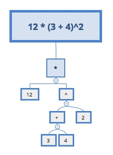
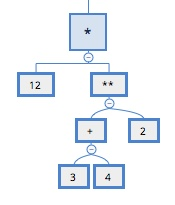

# 实现记录

## 目标

本项目的目标是实现wcc工具的大部分功能。该工具会遍历输入的文件列表，读取相应的文件，分别解析其中的组件(小程序中每一个标签即为一个组件)，最后将它们组合起来输出一个JS文件。这个JS文件由三部分构成：首部定义了许多用于生成或组合虚拟节点的函数，中部存放所有组件的属性值，尾部将各个组件以函数组合的形式描述出来。

本项目主要完成的工作是该JS文件后两部分的生成工作。

简化后的示例：
> 输入

```html
<button bindtap="addNumberToFront"> Add to the front </button>
```

> 输出

```js
======== 顶部定义的函数 ========
function _createTagNode(tag) { // 根据组件名创建虚拟节点
  return {
    tag: tag
    attr: {},
    children: [],
    n: []
  }
}
function _pushChild(a, b) { // 父组件接收子组件
  b && a.children.push(b)
}

======== 中部数据收集 ========
var z = []
function Z(ops) {
  z.push(ops)
}
Z([3, 'addNumberToFront'])
Z([3, ' Add to the front '])

======== 底部组件声明 ========
var A = _createTagNode('button')  // 生成button组件
_attachAttribute(A, 'bindtap', 0) // 绑定属性 !!!!!! -> 0代表z数组中的第一个元素
var B = _createTextNode(1) // 生成子组件 !!!!!! -> 1代表z数组中的第一个元素
_pushChild(A, B) // 父组件接收子组件
_pushChild(rootNode, A) // 根组件接收父组件
```

## 基础概念

转译器在现代前端开发过程中是一个必不可少的工具，如babel、uglifyjs以及postcss。这些工具的作用是将一门高级语言转换成同种或其它种类的高级语言，以拓展原有代码的功能或优化原有代码的性能。与传统的编译器或解释器不同，它并不需要生成与平台相关的二进制代码。

大部分转译器主要由以下三个部分构成：

- 解析器(parser)
- 代码优化器(optimizer)或代码转换器（transformer）
- 代码生成器(generator)

> 解释器

解析器会进行词法分析和语义分析。首先，词法分析负责将输入的代码文本拆分成一个个单词或算符（统称Token），如`12 * (3 + 4)^2`会被拆分为`12`、`*`、`(`、`3`、`+`、`4`、`)`、`^`和`2`。然后，语义分析器将这些Token组装成一颗语法树（AST == Abstract Syntax Tree）,如下图：



> 代码转换器

代码转换器负责将原有的ast转换成我们期望的ast，以上例，如果我们想要把自然语言的`^`符号换成Python的`**`，我们可以直接修改原有的ast：



当目标代码和原有代码差别较大时，可以直接遍历原有ast生成一颗新的ast。

> 代码生成器

通过递归遍历AST，生成目标代码。以上图较为简单的ast为例，可以将其转换成多种目标语言：

Python

```python
12 * (3 + 4) ** 2
```

Racket

```lisp
#lang racket

; 提前声明**函数
(define **
  (lambda (a b)
    (expt a b)))

; 遍历AST生成的代码
(* 12
   (** (+ 3
          4)
       2
```

当然，以上只是简述，各部分具体的实现都有很多值得研究的地方。

## 本项目整体转译流程

- 根据输入的列表，读取所有文件
- 调用VUE的HTML Parser，解析输入的标签及属性，生成一颗DOM树
- 在解析组件的起始标签时，对其上包含的属性值进行解析（边Parse边做Transform）
- 根据已有的AST生成JS文件（Generate）

## 顶部部分：直接复制

顶部定义的代码提供给尾部的代码使用，这部分代码直接复制进目标文件即可：

```js
export function genTemplate(slot) {
  return `
   // 顶部定义的各种函数
   function _a () {}
   function _b () {}
   function _c () {}

   // 中部和尾部代码
   ${slot}
  `
}
```

## 中间部分：wxml属性的处理

该部分的作用是收集所有文件内所有组件上的所有属性的值, 尾部代码将会使用这些属性。引用时首先找出所需属性在数组中所出现的位置，然后将其作为参数传递给节点生产函数。

小程序支持在组件属性中绑定动态值，如下面代码中view组件的hidden属性值是动态生成的，这个值包裹在双花括号中:

```html
<view hidden="{{flag ? true : false}}"> Hidden </view>
```

双花括号中的代码为JS语言，VUE内置的HTML Parser不能处理该语言，所以此处需要引入一个JS Parser来解析花括号中的属性，本项目中使用的解析器为：[babylon](https://github.com/babel/babylon)

从文章开头的示例，你可以看到，组件的属性值会被解析成数组的形式，这是我们的目标语言，而输入的语言则为JS。首先我们使用JS解析器将JS语言转换为相应的AST：

```js
=== 输入 JS===
3 + 4

=== 输出 AST===
{
    "type": "ExpressionStatement",
    "expression": {
        "type": "BinaryExpression",
        "left": {
            "type": "Literal",
            "value": 3,
        },
        "operator": "+",
        "right": {
            "type": "Literal",
            "value": 4,
        }
    }
}

=== 目标 数组形式 ===
[[2, "+"], [1, 3], [1, 4]]
```

从目标语言可以推测出，BinaryExpression 可以解析为如下形式：

```js
`[[2 "${operator}"], ${left}, ${right}]`
```

Literal 则解析为如下形式：

```js
`[[1], ${value}]`
```

使用JS代码实现的Code Generator如下([点我在线运行](https://babeljs.io/repl/#?babili=false&evaluate=true&lineWrap=true&presets=stage-3&targets=&browsers=&builtIns=false&debug=false&code_lz=MYewdgzgLgBAhtGBeGBvAUDLMBEUCeADgKY4BcuAogB6EBOxEEAluAMpRxTEC2xYUHABpM2HMVoMmrMOTSjsYgiTk4AQszBw6-GvUYtwwhYtwAbYgDNBFDKfu5lpCjgAyzbnThnjD0zgA3bwBXZxgAZhNFAF8RPxwQEi8oEDpVAGpfBxw6ZgBzAAsbeT9FPCIwtw9iLx840qxAkLCAFijsaJNOzvRLYLBgKBkYAHdvAGsYAAowEAATYgBKEpgIEY9gAunZhYA6J2W7bGAEYhgAcg0tHT0pQzBzsnaGKGC6MBgAAwBtb4AmIS4AAkqB2xF2iRqXFS0RwAF1ASCxmZxjN5uCLNZFrEYEiJmi9rlClBsXDPu0AEYMODjEwnCBnc7uTzeR7PYivd5fb4ARkRoPRuyCZlC0TJlOptKw3XQ6FAkFgoAWyFG-IQUF2En00nAizl4AgIAsuzMIDyUyVSyAA&prettier=false&showSidebar=true))：

```js
function walk (node) {
  switch (node.type) {
    case 'BinaryExpression':
      return `[[2, "${node.operator}"], ${walk(node.left)}, ${walk(node.right)}]`
      break
    case 'Literal':
      return `[1, ${node.value}]`
      break
  }
}

const code = walk(ast.expression)
```

转换后的属性值会被PUSH到数组z中，以供尾部的代码使用，为了方便的找寻其在数组中的位置，我们需要用到哈希表来记录属性值与其解析后的表达式之间的关系：

```js
=== 输入 HTML===
<button bindtap="addNumberToFront"> Add to the front </button>

=== 存放数据的结构 ===
{
  // 简析前后的映射（key为属性值，value为属性值在属性值列表中的位置）
  map: { 'addNumberToFront': 0, ' Add to the front ': 1 },
  // 解析后的数据
  props: [ '[3, \'addNumberToFront\']', '[3, \' Add to the front \']' ]
}
```

## 结尾部分：wxml标签的处理

尾部标签的处理与上面类似，先使用HTML Parser将HTML标签转换为一颗AST，再遍历AST来生成JS代码（[点我在线运行](https://babeljs.io/repl/#?babili=false&evaluate=true&lineWrap=true&presets=stage-3&targets=&browsers=&builtIns=false&debug=false&code_lz=MYewdgzgLgBAhtGBeGBvAUDGUCeAHAUwC4YByKOAc1IBpMYw4BbYsgIwFcopxb65uAJwCWbCCQDaqGAGsCOEqTbCwAEwp5aMAG5wANh1ak4q1QDkOTNgUEAVEADFB4KKRgBfALp0swABbCeqqCBGCS9FgYWNEwqgJwijAAgqbYINh-BDAAZs5gsHwxWLiEilAEAB6uER70nuju6OigkLB4zngAsnB4yGj0TD0k0ibmltZ2jnlQJAAMNGTJqTwZWbkuZCQAjB4-MO0geOIwEgBEEgDMC8amFlY29k4upJ6nC-dXiymqaas502RXvVGuhshwwMAoMJwDBKKEbAICGZmFkABQASn6WBCUA4gjAZAA-hU3ABqGDdKB-AB0gjgahATAx1J4AGUoCIwJRURcAGzo6kQDhiDmogBMCwu6IaTTBEKhMLhYFsBCYeD0iJgqIORwWED0ICgmKiMBaiB13Tw7MEfR1EGpgzw2o6yAAfDAAAYAL2peA4ED8qIAJKgde50R6BQArEAqVGkAA6YFI0uxBFx-M9NV0Nq9fQk9RiIYtPWtjRiNTlkOhBMJAgo_iSQlRYBAqgIC3rgmRLAWeBAEGNNSwrfb1K7Ei7PYInj6oDVXAIADV9IZUV6JP2IJ5U9Fy9FK-DqzD537yiuDARUbpL0OijAIAB3YRQfzX1cECSzHdY--mhBZKQFykEQw5FDieIEjehgSFshZFPuWCITANQhvqhr7h6MqgkeCoEo--gyFqo4dvscAhPk053qa4CIFW059EqCLlNOGL0E-L7-MRbYECy-AENRvgAWQFDUKB95mrAXYOEefQkeOQiiBAYFYA6PSoip0Rdm6mkxB6dbcHAjbNiG9Eou4NCnCGXbUnIODuG8xYdJaal4JOQjUtBM7hlhf4wLu97UjGcaJsmAXRBBma-X-OYwKZR7Tu4fSEsAISIrYVColZqDyYwLAOeFRaoNJR7IUV8n-IEwShK5qKVUEbowARegyHVARBAsZksOi0axmA8YpmV0SEn6AYAMLtaowahuRoRQIlMA0PFEKJYVWYxMAwnkJUrjieB6aQetMXkXFqBdQQSUoClaXlCqVRmDx00lngrkSPJcQUJ44aaSN_p-BNVVPbNlHmYty3AKtYHRY0IKSTR7Z9M1rUIFA1zOIaKbNLRIB6LxBrckqKpqhq5TOocLl2gsoDtj16BAA&prettier=false&showSidebar=true&#%3Fbabili=false&%23?babili=false)）

```js
=== 输入 HTML===
<button bindtap="addNumberToFront"> Add to the front </button>

=== 输出 AST===
const ast = {
  type: 'tag',
  name: 'button',
  attribs: [{ key: 'bindtap', value: 'addNumberToFront' }],
  children: [
    {
      data: ' Add to the front ',
      type: 'text'
    }
  ]
}

=== 目标 JS代码 ===
var A = _createTag("button")
_attachAttr(A,"bindtap",0)
var A = _createTextNode(1)
_pushChild(A ,A)
_pushChild(root ,A))
```
